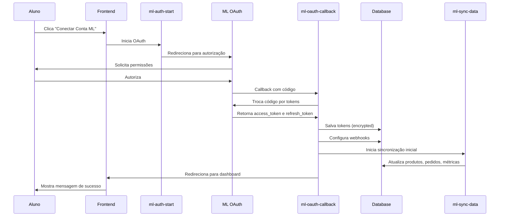
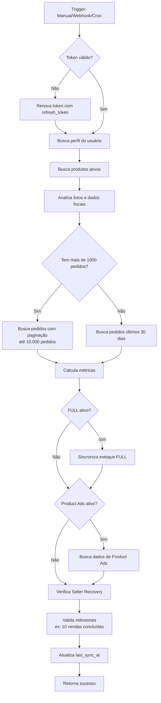
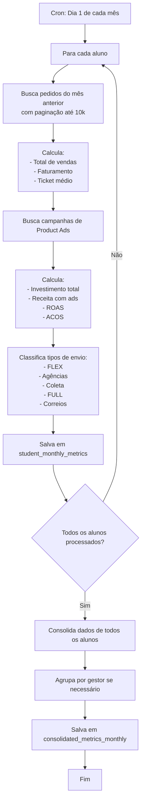
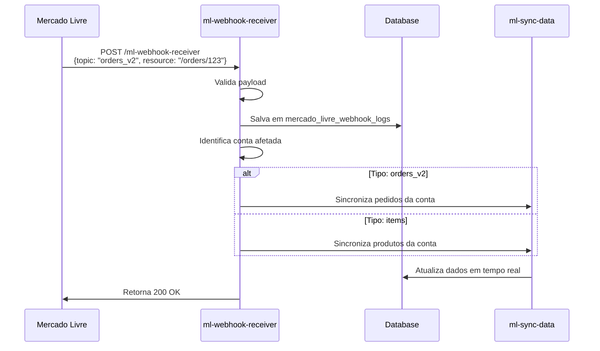

# ML PRO - Plataforma de Mentoria para Vendedores do Mercado Livre


Sistema completo de mentoria e gestão para vendedores do Mercado Livre, com acompanhamento de jornadas, análise de qualidade de anúncios, métricas de vendas e gestão de Product Ads.

---

## 📋 Índice

- [Sobre o Projeto](#-sobre-o-projeto)
- [Stack Tecnológico](#-stack-tecnológico)
- [Tipos de Usuários](#-tipos-de-usuários)
- [Telas e Funcionalidades](#-telas-e-funcionalidades)
- [Banco de Dados](#-banco-de-dados)
- [Edge Functions](#-edge-functions-backend)
- [Fluxos Principais](#-fluxos-principais)
- [Segurança (RLS)](#-segurança-rls-policies)
- [Features Especiais](#-features-especiais)
- [Instalação](#-instalação-e-desenvolvimento)
- [Deploy](#-deploy)
- [Estrutura de Pastas](#-estrutura-de-pastas)
- [Troubleshooting](#-troubleshooting)
- [Roadmap](#-roadmap--melhorias-futuras)

---

## 🎯 Sobre o Projeto

### Visão Geral
ML PRO é uma plataforma completa de mentoria que conecta gestores e alunos vendedores do Mercado Livre. O sistema permite acompanhar jornadas de aprendizado, métricas de vendas em tempo real, qualidade de anúncios e performance de campanhas publicitárias.

### Propósito
- **Acompanhamento de Jornadas**: Sistema de milestones personalizáveis para guiar o progresso dos alunos
- **Métricas em Tempo Real**: Sincronização automática de dados de vendas, faturamento e performance
- **Análise de Qualidade**: Health Score para cada anúncio com objetivos acionáveis
- **Gestão de Product Ads**: Acompanhamento completo de campanhas publicitárias com ROAS e ACOS
- **Gestão Multi-Conta**: Suporte para múltiplas contas do Mercado Livre por aluno

### Diferenciais
✅ Integração completa com Mercado Livre via OAuth 2.0  
✅ Sincronização automática de até 10.000 pedidos por conta  
✅ Sistema de jornadas flexível e personalizável  
✅ Análise avançada de qualidade de anúncios com Health Score  
✅ Métricas consolidadas mensais com histórico  
✅ Gestão inteligente de Product Ads e campanhas  
✅ Dashboard consolidado para gestores  
✅ Webhooks em tempo real do Mercado Livre  

---

## 🛠 Stack Tecnológico

### Frontend
- **React 18.3.1** - Biblioteca principal
- **TypeScript** - Tipagem estática
- **Vite** - Build tool e dev server
- **Tailwind CSS** - Framework CSS utility-first
- **shadcn/ui** - Componentes de UI
- **React Router DOM 6.30.1** - Roteamento
- **TanStack Query** - Gerenciamento de estado e cache
- **Recharts** - Gráficos e visualizações
- **date-fns** - Manipulação de datas
- **zod** - Validação de schemas
- **react-hook-form** - Formulários

### Backend (Supabase)
- **PostgreSQL** - Banco de dados relacional
- **Supabase** - Backend as a Service
- **Edge Functions (Deno)** - Serverless functions
- **Row Level Security (RLS)** - Segurança a nível de linha
- **Realtime Subscriptions** - Atualizações em tempo real
- **Webhooks** - Integração com eventos externos

### Integrações Externas
- **Mercado Livre API** - OAuth 2.0, vendas, produtos, reputação
- **Product Ads API** - Campanhas publicitárias
- **ML Webhooks** - Notificações de pedidos e produtos

---

## 👥 Tipos de Usuários

### 1️⃣ Student (Aluno)
**Perfil**: Vendedor em processo de mentoria

**Permissões**:
- Conectar múltiplas contas do Mercado Livre
- Visualizar apenas seus próprios dados
- Acompanhar sua jornada e milestones
- Gerenciar suas contas ML

**Acesso a**:
- Dashboard pessoal com métricas dos últimos 30 dias
- Gestão de contas do Mercado Livre
- Acompanhamento de jornada (onboarding, estrutura, profissionalização)
- Análise de qualidade de anúncios (Health Score)
- Product Ads e campanhas publicitárias
- Estoque FULL
- Perfil e configurações

### 2️⃣ Manager (Gestor)
**Perfil**: Gerencia um grupo de alunos

**Permissões**:
- Visualizar métricas consolidadas de seus alunos atribuídos
- Criar e editar alunos
- Gerenciar jornadas e milestones
- Atribuir apps e extensões

**Acesso a**:
- Dashboard consolidado (soma de todos os alunos)
- Lista e detalhes de alunos sob sua gestão
- Gestão de jornadas e templates
- Sincronização em massa de contas ML
- Relatórios e acompanhamento de progresso

### 3️⃣ Administrator (Administrador)
**Perfil**: Acesso total ao sistema

**Permissões**:
- Gerenciar todos os usuários (alunos e gestores)
- Configurações globais do sistema
- Acesso a todas as funcionalidades

**Acesso a**:
- Todas as funcionalidades do Gestor
- Gestão de equipe (criar/editar gestores)
- Configuração de planos e bônus
- Gestão de avisos e links importantes
- Agendamento de calls
- Gestão de templates de jornadas
- Visualização de dados de todos os alunos

---

## 📱 Telas e Funcionalidades

### Telas Públicas
| Rota | Descrição |
|------|-----------|
| `/` | Página inicial - Login ou redirecionamento para dashboard |
| `/auth` | Autenticação (Login/Registro) |

### Telas do Aluno (Student)

#### `/aluno/dashboard` - Dashboard Principal
**Métricas dos Últimos 30 Dias**:
- 📊 **Faturamento Total**: Soma de todas as vendas
- 🛒 **Número de Vendas**: Total de pedidos concluídos
- 💰 **Ticket Médio**: Faturamento / Número de vendas

**Product Ads**:
- 💳 **Total Investido**: Soma de gastos em campanhas
- 💵 **Receita com Ads**: Vendas atribuídas aos anúncios
- 📈 **ROAS**: Return on Ad Spend (Receita / Investimento)
- 📊 **ACOS**: Advertising Cost of Sale (Investimento / Receita)

**Tipos de Envio** (classificação de produtos):
- 🚀 **FLEX**: Produtos com envio FLEX
- 📍 **Agências**: Produtos com envio por agências
- 📦 **Coleta**: Produtos com coleta
- 🏢 **FULL**: Produtos no programa FULL
- 📮 **Envio Próprio**: Produtos com envio por Correios

**Histórico Mensal**:
- Tabela com métricas mensais consolidadas
- Gráfico de comparação mês a mês

**Recursos**:
- Filtro de período (7, 15, 30 dias)
- Sincronização manual de dados
- Paginação automática até 10.000 pedidos

#### `/aluno/jornadas` - Jornada e Milestones
**Visualização de Progresso**:
- Barra de progresso geral
- Milestones por fase:
  - 🎯 Onboarding
  - 🏗️ Estrutura Inicial
  - 💼 Profissionalização

**Status dos Milestones**:
- ⚪ Não iniciado
- 🟡 Em progresso
- 🟢 Concluído

**Validação Automática**:
- Exemplo: Milestone "10 vendas concluídas" valida automaticamente ao atingir a meta

#### `/aluno/contas-ml` - Contas do Mercado Livre
**Gestão de Contas**:
- Lista de contas ML conectadas
- Botão "Conectar Nova Conta" (OAuth)
- Status de sincronização (data/hora da última sync)
- Métricas gerais por conta:
  - Vendas últimos 30 dias
  - Reputação
  - Status do Decola
  - FULL ativo/inativo

**Ações**:
- Conectar nova conta
- Sincronizar dados manualmente
- Desconectar conta
- Ver detalhes da conta

#### `/aluno/ml-account/:accountId` - Performance da Conta ML
**Sistema de Abas**:

**Aba 1: Geral**
- 📊 Métricas de Performance:
  - Vendas concluídas
  - Faturamento
  - Ticket médio
- ⭐ **Reputação**: Badge colorido (verde/amarelo/vermelho)
- 🚀 **Programa Decola**: Status ativo/inativo
- 🏢 **FULL**: Status e produtos elegíveis
- 👑 **Mercado Líder**: Status e categoria

**Aba 2: Anúncios (Quality Analysis)**
- 📈 **Dashboard Geral de Qualidade**:
  - Porcentagem de anúncios por categoria
  - Excelente (80-100%)
  - Boa (60-79%)
  - Requer Atenção (40-59%)
  - Crítica (0-39%)
- 🔍 **Análise Individual por Produto**:
  - Health Score (0-100%)
  - Lista de objetivos (goals):
    - ✅ Adicionar descrição
    - ✅ Melhorar fotos
    - ✅ Adicionar dados fiscais
    - ✅ Melhorar título
  - Botão "Ver no ML" para editar
- 📊 **Histórico de Qualidade**: Evolução nos últimos 30 dias

**Aba 3: Estoque FULL**
- 📦 Lista de produtos no programa FULL
- Status de estoque:
  - ✅ Em estoque
  - ⚠️ Baixo estoque
  - ❌ Sem estoque
- Informações:
  - Quantidade disponível
  - Quantidade reservada
  - SKU
  - Link para gerenciar no ML

**Aba 4: Publicidade (Product Ads)**
- 📊 **Métricas Consolidadas**:
  - Total investido no período
  - Receita gerada
  - ROAS médio
  - ACOS médio
- 📢 **Campanhas Ativas**:
  - Nome da campanha
  - Budget diário
  - Status (ativa/pausada)
  - Performance (cliques, impressões)
- 🎯 **Produtos Anunciados**:
  - Lista de produtos em campanhas
  - Métricas individuais
  - CPC (custo por clique)
- 💡 **Recomendações**:
  - Produtos sugeridos para anunciar
  - Score de potencial
  - Estimativa de performance

### Telas do Gestor/Administrador

#### `/gestor/dashboard` - Dashboard Consolidado
**Visualmente idêntico ao dashboard do aluno, mas com dados consolidados**

**Métricas Totais** (soma de todos os alunos sob gestão):
- 📊 Faturamento Total
- 🛒 Número de Vendas Total
- 💰 Ticket Médio Geral
- 💳 Total Investido em Ads
- 💵 Receita com Ads
- 📈 ROAS Médio
- 📊 ACOS Médio

**Tipos de Envio Consolidado**:
- Total de produtos por tipo de envio (todos os alunos)

**Filtros**:
- 📅 Período (7, 15, 30 dias)
- 👤 Gestor específico (apenas para administradores)

#### `/gestor/alunos` - Gestão de Alunos
**Tabela Completa**:
- 👤 Nome do aluno
- 📧 Email
- 📊 Status (ativo/inativo)
- 👨‍🏫 Gestor responsável
- 📱 Contas ML conectadas

**Indicadores Visuais**:
- 🚀 Badge Decola (verde se ativo)
- 🚀 Badge FLEX (verde se ativo)
- 🏢 Badge FULL (verde se ativo)
- 📍 Badge Agências (roxo com quantidade)

**Progresso por Jornada**:
- Barra de progresso visual
- Porcentagem de milestones concluídos

**Apps Atribuídos**:
- Lista de apps/extensões que o aluno tem acesso

**Ações**:
- ➕ Criar novo aluno
- ✏️ Editar aluno
- 👁️ Visualizar detalhes
- 🗑️ Excluir aluno
- 🔄 Sincronizar contas ML em massa

**Filtros**:
- 🔍 Busca por nome
- 📊 Status
- 👨‍🏫 Gestor

#### `/gestor/aluno/:studentId` - Detalhes do Aluno
**Informações Completas**:
- 📋 Dados pessoais e de contato
- 📊 Status da jornada
- 🏆 Milestones concluídos
- 📱 Todas as contas ML do aluno
- 📈 Métricas consolidadas
- 📊 Gráficos de evolução
- 📝 Histórico de atividades

**Ações Disponíveis**:
- Editar informações
- Gerenciar apps atribuídos
- Forçar sincronização de contas
- Ver histórico completo

#### `/gestor/jornada` - Gestão de Jornadas
**Templates de Jornadas**:
- Lista de jornadas disponíveis
- Criar nova jornada
- Editar jornada existente

**Gestão de Milestones**:
- Criar milestone
- Editar milestone
- Definir fase (Onboarding, Estrutura, Profissionalização)
- Definir ordem de exibição
- Ativar/desativar milestone
- Configurar validação automática

**Sincronização**:
- Ao editar template, sincroniza com alunos que usam esse template
- Preserva progresso já realizado

#### `/gestor/equipe` - Gestão de Equipe *(apenas Admin)*
**Gestão de Gestores**:
- Lista de todos os gestores
- Criar novo gestor
- Editar gestor
- Desativar gestor

**Atribuição de Alunos**:
- Atribuir alunos a gestores
- Transferir alunos entre gestores
- Visualizar carga de trabalho por gestor

### Telas Comuns (Todos os Usuários)
| Rota | Descrição |
|------|-----------|
| `/perfil` | Perfil do usuário logado |
| `/configuracoes` | Configurações da conta |

---

## 🗄 Banco de Dados

### Estrutura Completa

#### 1. Autenticação e Usuários
```sql
-- Tabela de perfis (estende auth.users)
profiles
  - id: uuid (PK, references auth.users)
  - full_name: text
  - avatar_url: text
  - created_at: timestamp
  - updated_at: timestamp

-- Roles dos usuários
user_roles
  - id: uuid (PK)
  - user_id: uuid (FK -> profiles)
  - role: text (student, manager, administrator)
  - created_at: timestamp
```

#### 2. Mercado Livre - Contas e Dados
```sql
-- Contas ML conectadas (contém tokens sensíveis)
mercado_livre_accounts
  - id: uuid (PK)
  - student_id: uuid (FK -> profiles)
  - ml_user_id: bigint
  - nickname: text
  - email: text
  - access_token: text (encrypted)
  - refresh_token: text (encrypted)
  - token_expires_at: timestamp
  - account_type: text
  - site_id: text
  - last_sync_at: timestamp
  - created_at: timestamp
  - updated_at: timestamp

-- View segura (sem tokens)
mercado_livre_accounts_safe
  - mesmos campos, exceto access_token e refresh_token

-- Métricas em tempo real
mercado_livre_metrics
  - id: uuid (PK)
  - account_id: uuid (FK -> mercado_livre_accounts)
  - total_sales: numeric
  - completed_sales: integer
  - total_revenue: numeric
  - average_ticket: numeric
  - reputation_level: text
  - reputation_score: numeric
  - decola_active: boolean
  - full_active: boolean
  - mercado_lider: boolean
  - category_id: text
  - last_30_days_sales: integer
  - last_30_days_revenue: numeric
  - created_at: timestamp
  - updated_at: timestamp

-- Produtos/Anúncios
mercado_livre_products
  - id: uuid (PK)
  - account_id: uuid (FK -> mercado_livre_accounts)
  - ml_product_id: text (unique)
  - title: text
  - price: numeric
  - available_quantity: integer
  - sold_quantity: integer
  - status: text (active, paused, closed)
  - permalink: text
  - thumbnail: text
  - shipping_mode: text (flex, me2, custom, etc.)
  - listing_type_id: text
  - category_id: text
  - condition: text
  - has_pictures: boolean
  - has_description: boolean
  - has_tax_data: boolean
  - full_eligible: boolean
  - created_at: timestamp
  - updated_at: timestamp

-- Pedidos
mercado_livre_orders
  - id: uuid (PK)
  - account_id: uuid (FK -> mercado_livre_accounts)
  - ml_order_id: bigint (unique)
  - status: text
  - status_detail: text
  - date_created: timestamp
  - date_closed: timestamp
  - total_amount: numeric
  - paid_amount: numeric
  - shipping_type: text
  - buyer_id: bigint
  - items: jsonb
  - created_at: timestamp
  - updated_at: timestamp

-- Webhooks configurados
mercado_livre_webhooks
  - id: uuid (PK)
  - account_id: uuid (FK -> mercado_livre_accounts)
  - topic: text (orders_v2, items)
  - application_id: text
  - user_id: bigint
  - webhook_id: text
  - created_at: timestamp

-- Logs de webhooks recebidos
mercado_livre_webhook_logs
  - id: uuid (PK)
  - account_id: uuid (FK -> mercado_livre_accounts)
  - topic: text
  - resource: text
  - user_id: bigint
  - application_id: text
  - payload: jsonb
  - processed: boolean
  - processed_at: timestamp
  - created_at: timestamp
```

#### 3. Product Ads
```sql
-- Produtos com anúncios
mercado_livre_product_ads
  - id: uuid (PK)
  - account_id: uuid (FK -> mercado_livre_accounts)
  - product_id: uuid (FK -> mercado_livre_products)
  - advertiser_id: text
  - campaign_id: text
  - campaign_name: text
  - ad_id: text
  - status: text (active, paused)
  - daily_budget: numeric
  - total_budget: numeric
  - impressions: integer
  - clicks: integer
  - spend: numeric
  - revenue: numeric
  - roas: numeric
  - acos: numeric
  - cpc: numeric
  - ctr: numeric
  - conversion_rate: numeric
  - orders: integer
  - created_at: timestamp
  - updated_at: timestamp

-- Campanhas de publicidade
mercado_livre_campaigns
  - id: uuid (PK)
  - account_id: uuid (FK -> mercado_livre_accounts)
  - campaign_id: text (unique)
  - advertiser_id: text
  - name: text
  - status: text
  - objective: text
  - daily_budget: numeric
  - total_budget: numeric
  - start_date: date
  - end_date: date
  - impressions: integer
  - clicks: integer
  - spend: numeric
  - revenue: numeric
  - created_at: timestamp
  - updated_at: timestamp
```

#### 4. Qualidade e Estoque
```sql
-- Score de qualidade dos anúncios
mercado_livre_item_health
  - id: uuid (PK)
  - account_id: uuid (FK -> mercado_livre_accounts)
  - product_id: uuid (FK -> mercado_livre_products)
  - ml_product_id: text
  - health_score: numeric (0-100)
  - category: text (excellent, good, needs_attention, critical)
  - goals: jsonb (lista de objetivos)
  - has_description: boolean
  - has_good_pictures: boolean
  - has_tax_data: boolean
  - has_good_title: boolean
  - created_at: timestamp
  - updated_at: timestamp

-- Histórico de qualidade
mercado_livre_health_history
  - id: uuid (PK)
  - item_health_id: uuid (FK -> mercado_livre_item_health)
  - health_score: numeric
  - changes: jsonb
  - created_at: timestamp

-- Estoque FULL
mercado_livre_full_stock
  - id: uuid (PK)
  - account_id: uuid (FK -> mercado_livre_accounts)
  - product_id: uuid (FK -> mercado_livre_products)
  - ml_product_id: text
  - sku: text
  - available_quantity: integer
  - reserved_quantity: integer
  - warehouse_id: text
  - last_updated: timestamp
  - created_at: timestamp
  - updated_at: timestamp
```

#### 5. Seller Recovery
```sql
-- Programa de recuperação de vendedores
mercado_livre_seller_recovery
  - id: uuid (PK)
  - account_id: uuid (FK -> mercado_livre_accounts)
  - is_eligible: boolean
  - status: text
  - recovery_type: text
  - start_date: date
  - end_date: date
  - benefits: jsonb
  - requirements: jsonb
  - progress: numeric
  - created_at: timestamp
  - updated_at: timestamp
```

#### 6. Jornadas e Milestones
```sql
-- Jornada de cada aluno
student_journeys
  - id: uuid (PK)
  - student_id: uuid (FK -> profiles)
  - manager_id: uuid (FK -> profiles)
  - template_id: uuid (FK -> journey_templates)
  - status: text
  - progress: numeric (0-100)
  - started_at: timestamp
  - completed_at: timestamp
  - created_at: timestamp
  - updated_at: timestamp

-- Templates de jornadas
journey_templates
  - id: uuid (PK)
  - name: text
  - description: text
  - is_active: boolean
  - created_by: uuid (FK -> profiles)
  - created_at: timestamp
  - updated_at: timestamp

-- Milestones dos alunos
milestones
  - id: uuid (PK)
  - journey_id: uuid (FK -> student_journeys)
  - template_id: uuid (FK -> milestone_templates)
  - title: text
  - description: text
  - phase: text (onboarding, estrutura_inicial, profissionalizacao)
  - status: text (not_started, in_progress, completed)
  - order: integer
  - completed_at: timestamp
  - created_at: timestamp
  - updated_at: timestamp

-- Templates de milestones
milestone_templates
  - id: uuid (PK)
  - journey_template_id: uuid (FK -> journey_templates)
  - title: text
  - description: text
  - phase: text
  - order: integer
  - auto_validate: boolean
  - validation_criteria: jsonb
  - is_active: boolean
  - created_at: timestamp
  - updated_at: timestamp
```

#### 7. Planos e Bônus
```sql
-- Planos disponíveis
plans
  - id: uuid (PK)
  - name: text
  - description: text
  - price: numeric
  - duration_months: integer
  - features: jsonb
  - is_active: boolean
  - created_at: timestamp
  - updated_at: timestamp

-- Bônus do sistema
bonus
  - id: uuid (PK)
  - name: text
  - description: text
  - type: text
  - value: numeric
  - is_active: boolean
  - created_at: timestamp
  - updated_at: timestamp

-- Relacionamento plano-bônus
plan_bonus
  - id: uuid (PK)
  - plan_id: uuid (FK -> plans)
  - bonus_id: uuid (FK -> bonus)
  - delivery_condition: text
  - created_at: timestamp

-- Entrega de bônus aos alunos
student_bonus_delivery
  - id: uuid (PK)
  - student_id: uuid (FK -> profiles)
  - bonus_id: uuid (FK -> bonus)
  - delivered_at: timestamp
  - expires_at: timestamp
  - status: text
  - created_at: timestamp
```

#### 8. Configurações Gerais
```sql
-- Apps/extensões disponíveis
apps_extensions
  - id: uuid (PK)
  - name: text
  - description: text
  - icon_url: text
  - download_url: text
  - is_active: boolean
  - created_at: timestamp
  - updated_at: timestamp

-- Apps atribuídos aos alunos
student_apps
  - id: uuid (PK)
  - student_id: uuid (FK -> profiles)
  - app_id: uuid (FK -> apps_extensions)
  - assigned_at: timestamp
  - assigned_by: uuid (FK -> profiles)
  - created_at: timestamp

-- Avisos do sistema
notices
  - id: uuid (PK)
  - title: text
  - content: text
  - type: text (info, warning, success)
  - target_role: text (student, manager, all)
  - is_active: boolean
  - created_by: uuid (FK -> profiles)
  - created_at: timestamp
  - expires_at: timestamp

-- Links importantes
important_links
  - id: uuid (PK)
  - title: text
  - url: text
  - description: text
  - icon: text
  - order: integer
  - is_active: boolean
  - target_role: text
  - created_at: timestamp
  - updated_at: timestamp

-- Agendamento de calls
call_schedules
  - id: uuid (PK)
  - student_id: uuid (FK -> profiles)
  - manager_id: uuid (FK -> profiles)
  - scheduled_at: timestamp
  - duration_minutes: integer
  - meeting_url: text
  - notes: text
  - status: text (scheduled, completed, cancelled)
  - created_at: timestamp
  - updated_at: timestamp
```

#### 9. Métricas Consolidadas
```sql
-- Métricas mensais por aluno
student_monthly_metrics
  - id: uuid (PK)
  - student_id: uuid (FK -> profiles)
  - month: date
  - total_sales: integer
  - total_revenue: numeric
  - average_ticket: numeric
  - product_ads_spend: numeric
  - product_ads_revenue: numeric
  - product_ads_roas: numeric
  - product_ads_acos: numeric
  - flex_products: integer
  - agencias_products: integer
  - coleta_products: integer
  - full_products: integer
  - correios_products: integer
  - created_at: timestamp
  - updated_at: timestamp

-- Métricas mensais consolidadas (todos os alunos)
consolidated_metrics_monthly
  - id: uuid (PK)
  - month: date
  - manager_id: uuid (FK -> profiles) nullable
  - total_students: integer
  - total_sales: integer
  - total_revenue: numeric
  - average_ticket: numeric
  - product_ads_spend: numeric
  - product_ads_revenue: numeric
  - product_ads_roas: numeric
  - product_ads_acos: numeric
  - flex_products: integer
  - agencias_products: integer
  - coleta_products: integer
  - full_products: integer
  - correios_products: integer
  - created_at: timestamp
  - updated_at: timestamp

-- Logs de sincronização automática
ml_auto_sync_logs
  - id: uuid (PK)
  - account_id: uuid (FK -> mercado_livre_accounts)
  - sync_type: text
  - status: text (success, error)
  - error_message: text
  - duration_ms: integer
  - synced_items: jsonb
  - created_at: timestamp
```

---

## ⚡ Edge Functions (Backend)

### 1. Autenticação e Usuários
| Função | Descrição |
|--------|-----------|
| `create-student` | Cria novo aluno no sistema (usado por gestores) |
| `delete-user-auth` | Remove usuário do auth e todas as suas referências |

### 2. Integração Mercado Livre
| Função | Descrição |
|--------|-----------|
| `ml-auth-start` | Inicia fluxo OAuth do Mercado Livre |
| `ml-oauth-callback` | Processa callback OAuth, troca código por tokens |
| `ml-disconnect-account` | Desconecta conta ML do aluno |
| `ml-test-connection` | Testa conexão com API do ML |
| `ml-get-accounts` | Lista contas ML de um aluno |

### 3. Sincronização de Dados
| Função | Descrição |
|--------|-----------|
| `ml-sync-data` | **Função principal de sincronização**<br/>- Atualiza/renova tokens<br/>- Sincroniza produtos (com análise de fotos)<br/>- Sincroniza pedidos (últimos 30 dias, até 10k)<br/>- Atualiza métricas<br/>- Verifica Product Ads<br/>- Verifica Seller Recovery<br/>- Valida milestones |
| `ml-auto-sync-all` | Sincroniza todas as contas ML automaticamente (cron) |
| `ml-sync-status` | Verifica status de sincronização de uma conta |

### 4. Product Ads
| Função | Descrição |
|--------|-----------|
| `ml-get-product-ads-data` | Busca dados detalhados de Product Ads |
| `ml-check-product-ads-status` | Verifica se conta tem Product Ads ativo |
| `ml-debug-product-ads-response` | Debug de respostas da API de Product Ads |

### 5. Qualidade e Análise
| Função | Descrição |
|--------|-----------|
| `ml-get-item-health` | Busca score de qualidade de anúncios |
| `ml-get-products` | Lista produtos de uma conta ML |

### 6. Seller Recovery
| Função | Descrição |
|--------|-----------|
| `ml-get-seller-recovery-status` | Busca status do programa de recuperação |

### 7. Correções e Manutenção
| Função | Descrição |
|--------|-----------|
| `ml-fix-advertiser-ids` | Corrige IDs de anunciantes para Product Ads |
| `ml-fix-product-photos` | Corrige URLs de fotos de produtos |
| `ml-fix-tax-data` | Corrige dados fiscais de produtos |

### 8. Webhooks
| Função | Descrição |
|--------|-----------|
| `ml-webhook-receiver` | Recebe e processa webhooks do Mercado Livre |

### 9. Métricas
| Função | Descrição |
|--------|-----------|
| `calculate-monthly-metrics` | Calcula métricas consolidadas mensais (todos) |
| `calculate-student-monthly-metrics` | Calcula métricas mensais de um aluno específico |

---

## 🔄 Fluxos Principais

### 1. Fluxo de Conexão com Mercado Livre



**Detalhes**:
1. Usuário clica em "Conectar Conta ML"
2. Sistema gera URL de autorização OAuth com `ml-auth-start`
3. Usuário é redirecionado para página de autorização do ML
4. Usuário autoriza o app (permite acesso)
5. ML redireciona de volta para `ml-oauth-callback` com código de autorização
6. Edge function troca código por `access_token` e `refresh_token`
7. Tokens são salvos criptografados em `mercado_livre_accounts`
8. Sistema configura webhooks (orders_v2, items)
9. Inicia sincronização inicial de dados
10. Redireciona usuário para dashboard com mensagem de sucesso

### 2. Fluxo de Sincronização de Dados



**Paginação de Pedidos** (Tratamento especial para grandes volumes):
```typescript
// Busca até 10.000 pedidos em lotes de 1.000
const MAX_ORDERS = 10000;
const PAGE_SIZE = 1000;
let offset = 0;
let allOrders = [];

while (offset < MAX_ORDERS) {
  const orders = await fetchOrders(offset, PAGE_SIZE);
  if (orders.length === 0) break;
  
  allOrders = [...allOrders, ...orders];
  offset += PAGE_SIZE;
  
  if (orders.length < PAGE_SIZE) break; // Última página
}

// Se atingiu o limite, avisa o usuário
if (allOrders.length === MAX_ORDERS) {
  console.warn('Limite de 10.000 pedidos atingido');
}
```

**Consideração do Programa Decola**:
- Pedidos do programa Decola têm tratamento especial
- Desconto no faturamento é considerado nas métricas
- Métricas ficam mais precisas

### 3. Fluxo de Cálculo de Métricas Mensais



### 4. Fluxo de Webhooks



---

## 🔒 Segurança (RLS Policies)

### Princípios de Segurança
1. **Students**: Veem apenas seus próprios dados
2. **Managers**: Veem dados de alunos atribuídos a eles
3. **Administrators**: Veem todos os dados
4. **Service Role**: Acesso total (usado pelas Edge Functions)

### Exemplos de Policies

#### Policies para Students
```sql
-- Alunos veem apenas suas próprias contas ML
CREATE POLICY "Students can view own ML accounts" 
ON mercado_livre_accounts_safe 
FOR SELECT 
USING (student_id = auth.uid());

-- Alunos podem criar suas próprias contas (via OAuth)
CREATE POLICY "Students can insert own ML accounts" 
ON mercado_livre_accounts 
FOR INSERT 
WITH CHECK (student_id = auth.uid());

-- Alunos veem apenas seus próprios pedidos
CREATE POLICY "Students can view own orders" 
ON mercado_livre_orders 
FOR SELECT 
USING (
  account_id IN (
    SELECT id FROM mercado_livre_accounts 
    WHERE student_id = auth.uid()
  )
);
```

#### Policies para Managers
```sql
-- Gestores veem contas de seus alunos
CREATE POLICY "Managers can view accounts of their students"
ON mercado_livre_accounts_safe
FOR SELECT
USING (
  student_id IN (
    SELECT sj.student_id 
    FROM student_journeys sj 
    WHERE sj.manager_id = auth.uid()
  )
);

-- Gestores podem criar alunos
CREATE POLICY "Managers can create students"
ON profiles
FOR INSERT
WITH CHECK (
  EXISTS (
    SELECT 1 FROM user_roles 
    WHERE user_id = auth.uid() 
    AND role IN ('manager', 'administrator')
  )
);

-- Gestores podem editar alunos sob sua gestão
CREATE POLICY "Managers can update their students"
ON profiles
FOR UPDATE
USING (
  id IN (
    SELECT student_id FROM student_journeys 
    WHERE manager_id = auth.uid()
  )
);
```

#### Policies para Administrators
```sql
-- Administradores veem tudo
CREATE POLICY "Administrators can view all accounts"
ON mercado_livre_accounts_safe
FOR SELECT
USING (
  EXISTS (
    SELECT 1 FROM user_roles 
    WHERE user_id = auth.uid() 
    AND role = 'administrator'
  )
);

-- Administradores podem gerenciar gestores
CREATE POLICY "Administrators can manage managers"
ON user_roles
FOR ALL
USING (
  EXISTS (
    SELECT 1 FROM user_roles 
    WHERE user_id = auth.uid() 
    AND role = 'administrator'
  )
);
```

#### Policies para Service Role
```sql
-- Service role (Edge Functions) pode gerenciar tudo
CREATE POLICY "Service role can manage all"
ON mercado_livre_accounts
FOR ALL
USING (auth.jwt()->>'role' = 'service_role');
```

---

## ✨ Features Especiais

### 1. Sistema de Health Score de Anúncios

**Objetivo**: Analisar e pontuar a qualidade de cada anúncio (0-100%)

**Categorias**:
- 🟢 **Excelente**: 80-100% - Anúncio otimizado
- 🟡 **Boa**: 60-79% - Anúncio com bom potencial
- 🟠 **Requer Atenção**: 40-59% - Precisa de melhorias
- 🔴 **Crítica**: 0-39% - Urgente otimização

**Critérios de Avaliação**:
- ✅ **Descrição**: Anúncio tem descrição completa?
- ✅ **Fotos**: Tem pelo menos 3 fotos de qualidade?
- ✅ **Dados Fiscais**: NCM, origem, garantia configurados?
- ✅ **Título**: Título otimizado com palavras-chave?
- ✅ **Especificações**: Atributos técnicos preenchidos?

**Goals (Objetivos Acionáveis)**:
```typescript
{
  "description": {
    "completed": false,
    "title": "Adicionar descrição",
    "impact": "high",
    "action_url": "https://produto.mercadolivre.com.br/..."
  },
  "photos": {
    "completed": true,
    "title": "Adicionar fotos de qualidade"
  }
}
```

**Histórico de Evolução**:
- Registra mudanças no health score ao longo do tempo
- Permite visualizar progresso de melhorias
- Notifica quando há quedas significativas

### 2. Paginação Inteligente de Pedidos

**Problema**: API do ML tem limite de 1000 resultados por requisição

**Solução Implementada**:
```typescript
async function syncAllOrders(accountId: string) {
  const MAX_ORDERS = 10000;  // Limite de segurança
  const PAGE_SIZE = 1000;     // Tamanho da página
  const DELAY_MS = 500;       // Delay entre requisições
  
  let offset = 0;
  let allOrders = [];
  
  while (offset < MAX_ORDERS) {
    const orders = await mlApi.getOrders({
      seller_id: sellerId,
      offset: offset,
      limit: PAGE_SIZE,
      sort: 'date_desc'
    });
    
    if (orders.length === 0) break;
    
    allOrders.push(...orders);
    offset += PAGE_SIZE;
    
    // Delay para evitar rate limit
    if (orders.length === PAGE_SIZE) {
      await sleep(DELAY_MS);
    } else {
      break; // Última página
    }
  }
  
  // Aviso se atingiu limite
  if (allOrders.length === MAX_ORDERS) {
    console.warn(`Limite de ${MAX_ORDERS} pedidos atingido para conta ${accountId}`);
    // TODO: Notificar usuário
  }
  
  return allOrders;
}
```

**Benefícios**:
- ✅ Garante sincronização de até 10.000 pedidos
- ✅ Evita timeouts em contas grandes
- ✅ Respeita rate limits da API
- ✅ Avisa quando limites são atingidos

### 3. Sincronização Automática

**Cron Job Configurado**:
```toml
# supabase/config.toml
[functions.ml-auto-sync-all]
schedule = "0 */4 * * *"  # A cada 4 horas
```

**Fluxo**:
1. Edge function `ml-auto-sync-all` é executada automaticamente
2. Busca todas as contas ML ativas
3. Para cada conta:
   - Verifica se token está válido (renova se necessário)
   - Executa sincronização completa
   - Registra logs de sucesso/erro
4. Salva logs em `ml_auto_sync_logs`

**Benefícios**:
- ✅ Dados sempre atualizados
- ✅ Tokens renovados automaticamente
- ✅ Sem intervenção manual necessária
- ✅ Logs detalhados para troubleshooting

### 4. Product Ads Intelligence

**Detecção Automática**:
```typescript
// Verifica se conta tem Product Ads ativo
const hasProductAds = await mlApi.checkProductAdsStatus(mlUserId);

if (hasProductAds) {
  // Busca advertiser_id
  const advertiser = await mlApi.getAdvertiser(mlUserId);
  
  // Sincroniza campanhas
  const campaigns = await mlApi.getCampaigns(advertiser.id);
  
  // Sincroniza métricas de produtos
  for (const campaign of campaigns) {
    const metrics = await mlApi.getCampaignMetrics(campaign.id);
    // Calcula ROAS, ACOS, etc.
  }
}
```

**Métricas Calculadas**:
- **ROAS** (Return on Ad Spend): `revenue / spend`
- **ACOS** (Advertising Cost of Sale): `spend / revenue * 100`
- **CPC** (Cost Per Click): `spend / clicks`
- **CTR** (Click-Through Rate): `clicks / impressions * 100`
- **Conversion Rate**: `orders / clicks * 100`

**Recomendações Inteligentes**:
- Produtos com alto potencial de venda
- Produtos sem anúncio mas com bom histórico
- Sugestões de budget baseadas em performance

### 5. Sistema de Jornadas Flexível

**Templates Reutilizáveis**:
```typescript
// journey_templates
{
  "id": "uuid",
  "name": "Jornada Padrão 2024",
  "description": "Jornada completa para novos alunos",
  "is_active": true
}

// milestone_templates
{
  "journey_template_id": "uuid",
  "title": "Primeira Venda",
  "description": "Realize sua primeira venda no Mercado Livre",
  "phase": "onboarding",
  "order": 1,
  "auto_validate": true,
  "validation_criteria": {
    "type": "sales_count",
    "min_value": 1
  }
}
```

**Validação Automática**:
```typescript
// Após sincronização de pedidos
const completedSales = orders.filter(o => o.status === 'delivered').length;

// Verifica milestones pendentes com validação automática
const milestones = await db.milestones.findMany({
  where: {
    journey_id: journeyId,
    status: 'in_progress',
    template: {
      auto_validate: true,
      validation_criteria: {
        type: 'sales_count'
      }
    }
  }
});

for (const milestone of milestones) {
  const { min_value } = milestone.template.validation_criteria;
  
  if (completedSales >= min_value) {
    await db.milestones.update({
      where: { id: milestone.id },
      data: {
        status: 'completed',
        completed_at: new Date()
      }
    });
  }
}
```

**Sincronização ao Editar Templates**:
- Quando um template é editado, todos os alunos que usam esse template são atualizados
- Milestones já concluídos são preservados
- Novos milestones são adicionados automaticamente

---

## 💻 Instalação e Desenvolvimento

### Pré-requisitos
- **Node.js** 18+ ou **Bun**
- **Git**
- Conta no **Supabase** (para backend e banco de dados)
- Conta no **Vercel** (para deploy do frontend)
- App no **Mercado Livre** ([criar app](https://developers.mercadolivre.com.br/pt_br/registre-sua-aplicacao))

### Passos para Instalação

```bash
# 1. Clone o repositório
git clone https://github.com/seu-usuario/ml-pro.git
cd ml-pro

# 2. Instale as dependências
npm install
# ou
bun install

# 3. Configure variáveis de ambiente
# Copie o arquivo .env.example para .env e configure as variáveis do Supabase
cp .env.example .env

# Configure os secrets do Mercado Livre no Supabase
# Dashboard > Settings > Secrets

# 4. Inicie o servidor de desenvolvimento
npm run dev
# ou
bun run dev
```

### Configuração do App Mercado Livre

1. Acesse [Mercado Livre Developers](https://developers.mercadolivre.com.br/)
2. Crie uma aplicação
3. Configure a **URL de Callback**:
   ```
   https://seu-projeto.supabase.co/functions/v1/ml-oauth-callback
   ```
4. Anote o **App ID** e **Secret Key**
5. Configure os secrets no Supabase:
   - Acesse Supabase Dashboard > Project Settings > Edge Functions > Secrets
   - Adicione `MERCADO_LIVRE_APP_ID`
   - Adicione `MERCADO_LIVRE_SECRET_KEY`

### Estrutura de Secrets

```bash
# Backend (Supabase - configurados via Dashboard)
MERCADO_LIVRE_APP_ID=seu_app_id
MERCADO_LIVRE_SECRET_KEY=sua_secret_key
APP_URL=https://seu-projeto.vercel.app

# Frontend (.env)
VITE_SUPABASE_URL=https://seu-projeto.supabase.co
VITE_SUPABASE_PUBLISHABLE_KEY=eyJ...
VITE_SUPABASE_ANON_KEY=sua_chave_anon
```

---

## 🚀 Deploy

### Deploy na Vercel

1. Conecte seu repositório à Vercel
2. Configure as variáveis de ambiente do Supabase
3. O deploy é feito automaticamente em minutos
4. Edge Functions são deployadas no Supabase
5. Seu app estará disponível em: `https://ml-pro-five.vercel.app`

**Vantagens**:
- ✅ Zero configuração
- ✅ HTTPS automático
- ✅ CDN global
- ✅ Builds automáticos a cada push
- ✅ Preview de branches
- ✅ Analytics integrado

### Conectar Domínio Customizado

1. Vá em **Project Settings** > **Domains**
2. Clique em **Add Domain**
3. Digite seu domínio (ex: `mlpro.com.br`)
4. Configure os registros DNS conforme instruído
5. Aguarde propagação DNS (até 48h)

### Deploy Alternativo (Self-Hosting)

```bash
# Build da aplicação
npm run build

# Os arquivos estarão em /dist
# Deploy para:
# - Vercel
# - Netlify  
# - AWS S3 + CloudFront
# - Digital Ocean
# - etc.
```

**Importante**: Configure as variáveis de ambiente no seu provedor de hosting

---

## 📁 Estrutura de Pastas

```
ml-pro/
│
├── src/                          # Código fonte frontend
│   │
│   ├── assets/                   # Recursos estáticos
│   │   └── logo.jpeg            # Logo ML PRO
│   │
│   ├── components/               # Componentes React
│   │   │
│   │   ├── ui/                  # Componentes shadcn/ui
│   │   │   ├── button.tsx
│   │   │   ├── card.tsx
│   │   │   ├── table.tsx
│   │   │   ├── badge.tsx
│   │   │   ├── dialog.tsx
│   │   │   └── ... (40+ componentes)
│   │   │
│   │   ├── ml-health/           # Análise de qualidade
│   │   │   ├── HealthDashboard.tsx
│   │   │   └── HealthIndividual.tsx
│   │   │
│   │   ├── Sidebar.tsx          # Navegação lateral
│   │   ├── StudentCard.tsx      # Card de aluno
│   │   ├── CampaignCard.tsx     # Card de campanha
│   │   ├── ProductAdsMetricCard.tsx
│   │   ├── SalesComparisonChart.tsx
│   │   ├── SimpleProductsTable.tsx
│   │   ├── RecommendedItemsTable.tsx
│   │   ├── TopPerformersCard.tsx
│   │   └── ReputationBadge.tsx
│   │
│   ├── hooks/                   # Custom React Hooks
│   │   ├── useAuth.tsx         # Hook de autenticação
│   │   ├── use-mobile.tsx      # Hook para detectar mobile
│   │   └── use-toast.ts        # Hook para toast notifications
│   │
│   ├── integrations/            # Integrações externas
│   │   └── supabase/
│   │       ├── client.ts       # Cliente Supabase (auto-gerado)
│   │       └── types.ts        # Types do banco (auto-gerado)
│   │
│   ├── lib/                     # Utilitários
│   │   └── utils.ts            # Funções auxiliares (cn, etc.)
│   │
│   ├── pages/                   # Páginas da aplicação
│   │   │
│   │   ├── Index.tsx           # Landing page
│   │   ├── Auth.tsx            # Login/Registro
│   │   │
│   │   ├── StudentDashboard.tsx        # Dashboard do aluno
│   │   ├── StudentJourney.tsx          # Jornada do aluno
│   │   ├── StudentProfile.tsx          # Perfil do aluno
│   │   ├── StudentDetails.tsx          # Detalhes do aluno (gestor)
│   │   │
│   │   ├── GestorDashboard.tsx         # Dashboard consolidado
│   │   ├── StudentsManagement.tsx      # Gestão de alunos
│   │   ├── JourneyManagement.tsx       # Gestão de jornadas
│   │   ├── TeamManagement.tsx          # Gestão de equipe
│   │   │
│   │   ├── MLAccountDashboard.tsx      # Performance conta ML
│   │   ├── MLAccountPerformance.tsx    # Detalhes da conta
│   │   │
│   │   ├── Profile.tsx         # Perfil do usuário
│   │   ├── Settings.tsx        # Configurações
│   │   └── NotFound.tsx        # Página 404
│   │
│   ├── App.tsx                  # Componente raiz + rotas
│   ├── main.tsx                 # Entry point
│   ├── index.css                # Estilos globais + design system
│   └── vite-env.d.ts           # Types do Vite
│
├── supabase/                    # Backend (Supabase)
│   │
│   ├── functions/               # Edge Functions (Deno)
│   │   │
│   │   ├── ml-oauth-callback/        # Callback OAuth ML
│   │   ├── ml-auth-start/            # Inicia OAuth ML
│   │   ├── ml-sync-data/             # Sincronização principal
│   │   ├── ml-auto-sync-all/         # Sync automática (cron)
│   │   ├── ml-sync-status/           # Status de sync
│   │   ├── ml-disconnect-account/    # Desconectar conta
│   │   ├── ml-test-connection/       # Testar conexão
│   │   ├── ml-get-accounts/          # Listar contas
│   │   │
│   │   ├── ml-get-products/          # Listar produtos
│   │   ├── ml-get-item-health/       # Health score
│   │   │
│   │   ├── ml-get-product-ads-data/         # Dados Product Ads
│   │   ├── ml-check-product-ads-status/     # Status Product Ads
│   │   ├── ml-debug-product-ads-response/   # Debug Product Ads
│   │   │
│   │   ├── ml-get-seller-recovery-status/   # Seller Recovery
│   │   │
│   │   ├── ml-fix-advertiser-ids/     # Corrige IDs
│   │   ├── ml-fix-product-photos/     # Corrige fotos
│   │   ├── ml-fix-tax-data/           # Corrige dados fiscais
│   │   │
│   │   ├── ml-webhook-receiver/       # Recebe webhooks ML
│   │   │
│   │   ├── calculate-monthly-metrics/        # Métricas mensais
│   │   ├── calculate-student-monthly-metrics/ # Métricas por aluno
│   │   │
│   │   ├── create-student/            # Cria aluno
│   │   └── delete-user-auth/          # Remove usuário
│   │
│   ├── migrations/              # Migrações do banco (auto-geradas)
│   └── config.toml             # Configuração Supabase
│
├── public/                      # Arquivos públicos
│   ├── robots.txt
│   ├── favicon.ico
│   └── placeholder.svg
│
├── .env                         # Variáveis de ambiente (auto-gerado)
├── .gitignore
├── package.json
├── package-lock.json
├── tsconfig.json
├── tsconfig.app.json
├── tsconfig.node.json
├── vite.config.ts              # Configuração Vite
├── tailwind.config.ts          # Configuração Tailwind
├── postcss.config.js
├── eslint.config.js
├── components.json             # Config shadcn/ui
└── README.md                   # Este arquivo
```

---

## 🧩 Principais Componentes

### Componentes de UI (shadcn/ui)
- `<Button>` - Botões com variantes
- `<Card>` - Cards com header, content, footer
- `<Table>` - Tabelas responsivas
- `<Badge>` - Badges de status
- `<Dialog>` - Modais
- `<Tabs>` - Sistema de abas
- `<Select>` - Selects customizados
- `<Input>` - Inputs de formulário
- `<Toaster>` - Notificações toast

### Componentes Customizados
| Componente | Descrição |
|------------|-----------|
| `<Sidebar />` | Navegação lateral com base em role |
| `<ReputationBadge />` | Badge de reputação do ML (cores dinâmicas) |
| `<HealthDashboard />` | Dashboard de qualidade de anúncios |
| `<HealthIndividual />` | Análise individual de anúncio |
| `<ProductAdsMetricCard />` | Card de métricas de Product Ads |
| `<SalesComparisonChart />` | Gráfico de comparação mensal (Recharts) |
| `<SimpleProductsTable />` | Tabela de produtos simplificada |
| `<RecommendedItemsTable />` | Tabela de produtos recomendados |
| `<CampaignCard />` | Card de campanha publicitária |
| `<StudentCard />` | Card de aluno com progresso |
| `<TopPerformersCard />` | Top performers do período |
| `<PlanBonusCard />` | Card de plano com bônus |

### Hooks Customizados
| Hook | Descrição |
|------|-----------|
| `useAuth()` | Gerencia autenticação, role, perfil |
| `useToast()` | Exibe notificações toast |
| `useMobile()` | Detecta se é dispositivo mobile |

---

## 🔧 Troubleshooting

### Problema: Conta ML não conecta

**Sintomas**:
- Erro ao clicar em "Conectar Conta"
- Redirecionamento falha
- Erro 401 Unauthorized

**Soluções**:
1. Verifique se `MERCADO_LIVRE_APP_ID` e `MERCADO_LIVRE_SECRET_KEY` estão configurados corretamente no Supabase
2. Confirme que a URL de callback está correta no app do ML:
   ```
   https://seu-projeto.supabase.co/functions/v1/ml-oauth-callback
   ```
3. Verifique os logs da Edge Function:
   - No Supabase Dashboard > Edge Functions > ml-oauth-callback > Logs
4. Tente reconectar a conta após corrigir configurações

### Problema: Métricas não atualizam

**Sintomas**:
- Dashboard mostra dados desatualizados
- Última sincronização muito antiga
- Métricas em zero

**Soluções**:
1. Force sincronização manual:
   - Dashboard > Botão "Sincronizar"
2. Verifique se o token não expirou:
   ```sql
   SELECT nickname, token_expires_at 
   FROM mercado_livre_accounts 
   WHERE token_expires_at < NOW();
   ```
3. Verifique logs de sincronização:
   ```sql
   SELECT * FROM ml_auto_sync_logs 
   WHERE status = 'error' 
   ORDER BY created_at DESC 
   LIMIT 10;
   ```
4. Tente desconectar e reconectar a conta ML

### Problema: Paginação não carrega todos os pedidos

**Sintomas**:
- Métricas parecem incompletas
- Aviso "Limite de pedidos atingido"
- Número de pedidos sempre 10.000

**Soluções**:
1. Verifique se há erro de rate limit nos logs:
   ```typescript
   // Busque por: "Rate limit exceeded"
   ```
2. Aumente o delay entre requisições paginadas:
   ```typescript
   // Em ml-sync-data/index.ts
   const DELAY_MS = 1000; // Aumentar de 500 para 1000
   ```
3. Considere sincronizar períodos menores:
   ```typescript
   // Sincronizar últimos 15 dias ao invés de 30
   const daysToSync = 15;
   ```
4. Verifique se a API do ML está com problemas:
   - [Status Page do ML](https://developers.mercadolivre.com.br/pt_br/status-da-api)

### Problema: Product Ads não aparece

**Sintomas**:
- Aba "Publicidade" vazia
- Não mostra campanhas
- Erro ao buscar advertiser_id

**Soluções**:
1. Verifique se a conta realmente tem Product Ads:
   - Entre no ML e verifique se há acesso a "Publicidade"
   - Nem todos os perfis têm acesso a Product Ads
2. Force verificação de status:
   ```typescript
   // Chame ml-check-product-ads-status manualmente
   ```
3. Verifique se `advertiser_id` está configurado:
   ```sql
   SELECT nickname, advertiser_id 
   FROM mercado_livre_metrics 
   WHERE advertiser_id IS NULL;
   ```
4. Execute função de correção:
   ```typescript
   // ml-fix-advertiser-ids
   ```

### Problema: Health Score sempre em 0%

**Sintomas**:
- Todos os anúncios com score 0%
- Nenhum "goal" aparece
- Categoria sempre "Crítica"

**Soluções**:
1. Verifique se `ml-get-item-health` está sendo chamado:
   ```sql
   SELECT COUNT(*) FROM mercado_livre_item_health;
   ```
2. Force análise de qualidade:
   - Sincronize a conta manualmente
3. Verifique logs de erro:
   ```sql
   SELECT * FROM ml_auto_sync_logs 
   WHERE error_message LIKE '%health%';
   ```
4. Verifique se produtos têm dados completos:
   ```sql
   SELECT title, has_pictures, has_description, has_tax_data 
   FROM mercado_livre_products 
   LIMIT 10;
   ```

### Problema: Webhooks não funcionam

**Sintomas**:
- Dados não atualizam automaticamente
- Tabela `mercado_livre_webhook_logs` vazia
- Mudanças no ML não refletem no sistema

**Soluções**:
1. Verifique se webhooks estão configurados:
   ```sql
   SELECT * FROM mercado_livre_webhooks;
   ```
2. Teste recepção de webhook:
   ```bash
   curl -X POST https://seu-projeto.supabase.co/functions/v1/ml-webhook-receiver \
     -H "Content-Type: application/json" \
     -d '{"topic": "orders_v2", "resource": "/orders/123", "user_id": 123}'
   ```
3. Verifique URL do webhook no ML:
   - Deve ser: `https://seu-projeto.supabase.co/functions/v1/ml-webhook-receiver`
4. Reconfigure webhooks:
   - Desconecte e reconecte a conta ML

---

## 🗺️ Roadmap / Melhorias Futuras

### Curto Prazo (1-3 meses)
- [ ] **Dashboard Mobile Responsivo**: Otimizar layout para smartphones
- [ ] **Notificações Push**: Avisar sobre vendas, milestones concluídos
- [ ] **Exportação de Relatórios**: PDF e Excel de métricas mensais
- [ ] **Filtros Avançados**: Por período, categoria, tipo de produto
- [ ] **Busca de Produtos**: Buscar por título, SKU, categoria

### Médio Prazo (3-6 meses)
- [ ] **Chat Interno**: Comunicação entre gestor e aluno
- [ ] **Gamificação**: Sistema de pontos, badges, rankings
- [ ] **Previsão de Vendas**: Machine Learning para prever tendências
- [ ] **Análise de Concorrência**: Comparar preços com concorrentes
- [ ] **Integração Google Analytics**: Rastrear eventos e conversões
- [ ] **Multi-idioma**: Suporte para Espanhol (América Latina)

### Longo Prazo (6-12 meses)
- [ ] **App Mobile Nativo**: iOS e Android (React Native)
- [ ] **Integração com Outras Marketplaces**: Shopee, Amazon, Shein
- [ ] **IA para Otimização de Anúncios**: Sugestões automáticas de melhorias
- [ ] **Automação de Tarefas**: Atualização de preços, descrições
- [ ] **API Pública**: Permitir integrações de terceiros
- [ ] **Marketplace de Apps**: Extensões criadas pela comunidade
- [ ] **White Label**: Versão customizável para outras mentorias

### Backlog
- [ ] Integração com ERPs (Bling, Omie, Tiny)
- [ ] Sistema de tickets de suporte
- [ ] Relatórios personalizados (drag & drop)
- [ ] Calendário de eventos e calls
- [ ] Biblioteca de conteúdo educacional
- [ ] Certificados de conclusão de jornadas
- [ ] Análise de sentimento de reviews

---

## 🤝 Contribuindo

Contribuições são bem-vindas! Para contribuir:

1. **Fork** o projeto
2. **Crie uma branch** para sua feature:
   ```bash
   git checkout -b feature/MinhaFeature
   ```
3. **Commit** suas mudanças:
   ```bash
   git commit -m 'feat: Adiciona nova feature X'
   ```
4. **Push** para a branch:
   ```bash
   git push origin feature/MinhaFeature
   ```
5. **Abra um Pull Request**

### Padrões de Commit
Usamos [Conventional Commits](https://www.conventionalcommits.org/):

- `feat:` Nova funcionalidade
- `fix:` Correção de bug
- `docs:` Documentação
- `style:` Formatação, ponto e vírgula faltando, etc.
- `refactor:` Refatoração de código
- `test:` Testes
- `chore:` Manutenção

### Code Style
- **TypeScript** para todo código
- **ESLint** para linting
- **Prettier** para formatação
- **Tailwind CSS** para estilos (sem CSS inline)

---

## 📄 Licença

Este projeto é **propriedade privada**. Todos os direitos reservados.

Uso não autorizado, reprodução ou distribuição deste software é estritamente proibido sem permissão prévia por escrito.

---

## 📞 Contato e Suporte

### Links Úteis
- **Mercado Livre Developers**: https://developers.mercadolivre.com.br
- **Documentação Supabase**: https://supabase.com/docs
- **Documentação Vercel**: https://vercel.com/docs

### Suporte
Para questões técnicas, bugs ou sugestões:
- 📧 **Email**: suporte@mlpro.com.br
- 💬 **Discord**: [Link do servidor]
- 📱 **WhatsApp**: +55 (XX) XXXXX-XXXX

---

## 🎉 Agradecimentos

- **Mercado Livre** - Pela API robusta e documentação
- **Supabase** - Pelo backend confiável
- **Vercel** - Pela plataforma de deploy
- **shadcn/ui** - Pelos componentes lindos
- **Comunidade Open Source** - Pelas bibliotecas utilizadas

---

<div align="center">
  <p>
    Feito com ❤️ por ML PRO Team
  </p>
  <p>
    <strong>ML PRO</strong> - Transformando vendedores em profissionais de sucesso no Mercado Livre
  </p>
</div>
